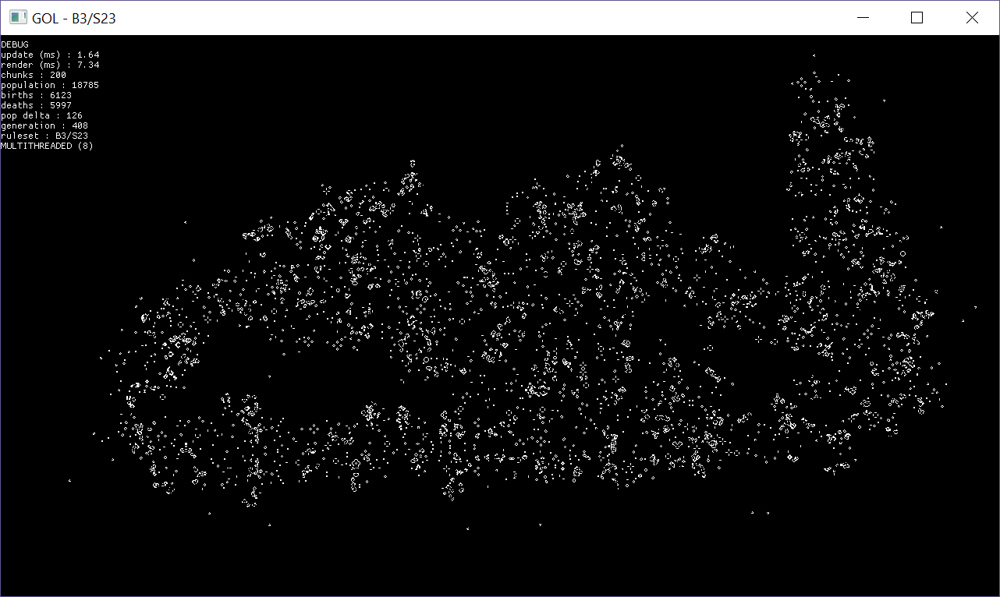

# Game Of Life

A personal experiment to implement "Conway's Game of Life" in a multithreaded environment.

The only dependency is [SFML 2.5.x](https://www.sfml-dev.org/) for window and graphics handling.
Typeface ProggyCleanSZ.ttf provided by [proggyfonts](https://proggyfonts.net/).

[View Changelog](./Changelog.md)

## Features

 - Multithreading support.
 - Unbounded universe simulation.
 - Minimal approach.

## Limitations

- B0 is not supported (due to unlimited universe size).
